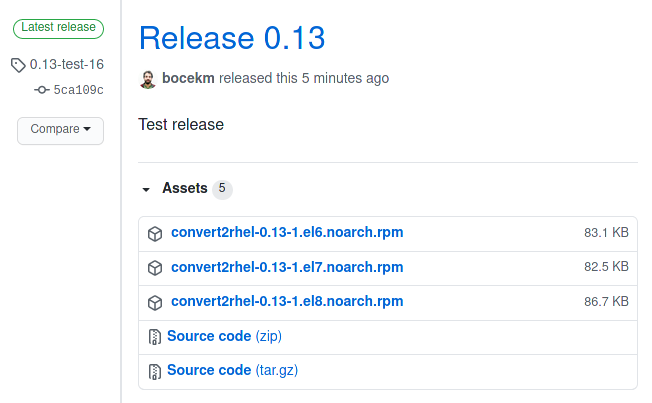

# Github Action - rpmbuild

Github action to build RPMs from a spec file, using git repo contents as source.

## Usage
### Pre-requisites
Create a workflow `.yml` file in your repositories `.github/workflows` directory. An [example workflow](#example-workflow---build-rpm) is available below. For more information, reference the GitHub Help Documentation for [Creating a workflow file](https://help.github.com/en/articles/configuring-a-workflow#creating-a-workflow-file). 

**Note:** You need to have a spec file in order to build RPM.


### Inputs

- `spec_path`: The path to the spec file in your repo. [**required**]
- `spec_name`: Rewrite Name: in the spec file.
- `spec_version`: Rewrite Version: in the spec file.
- `redownload_source`: Create source tar gz from the workspace by default, or specify true to redownload the source.
- `keep_debuginfo`: Many rpmbuilds generate a debuginfo package.  Default: false.
- `preinstall_packages`: Spec file BuildRequires are installed via yum-builddep/dnf builddep, prior to rpmbuild, but sometimes epel-release package must be installed before yum-builddep/dnf builddep is executed.  This does that.

### Outputs

- `srpm_dir`: Path to the directory with the generated SRPM file.
- `srpm_path`: Path to the generated SRPM file.
- `srpm_name`: Name of the generated SRPM file.
- `rpm_dir`: Path to the directory with the generated RPM file.
- `rpm_path`: Path to the generated RPM file.
- `rpm_name`: Name of the generated RPM file.
- `content_type`: Content-type for the RPM upload.

### Example

```yaml
---
name: Build release RPMs

on:
  release:
    types: [created]
  
jobs:
  build_el6_rpm:
    name: Build EL6 RPM
    runs-on: ubuntu-latest
    steps:
      - name: Checkout code
        uses: actions/checkout@v2

      - name: Build RPM package for EL6
        id: rpm_build_el6
        uses: bocekm/rpmbuild@el6
        with:
          spec_path: "path/to.spec"

      - name: Upload EL6 RPM as release asset
        id: upload_release_asset_el6
        uses: actions/upload-release-asset@v1
        env:
            GITHUB_TOKEN: ${{ secrets.GITHUB_TOKEN }}
        with:
            upload_url: ${{ github.event.release.upload_url }}
            asset_path: ${{ steps.rpm_build_el6.outputs.srpm_path }}
            asset_name: ${{ steps.rpm_build_el6.outputs.srpm_name }}
            asset_content_type: ${{ steps.rpm_build_el6.outputs.content_type }}

  build_el7_rpm:
    name: Build EL7 RPM
    runs-on: ubuntu-latest
    steps:
      - name: Checkout code
        uses: actions/checkout@v2

      - name: Build RPM package for EL7
        id: rpm_build_el7
        uses: bocekm/rpmbuild@el7
        with:
          spec_path: "path/to.spec"

      - name: Upload EL7 RPM as release asset
        id: upload_release_asset_el7
        uses: actions/upload-release-asset@v1
        env:
            GITHUB_TOKEN: ${{ secrets.GITHUB_TOKEN }}
        with:
            upload_url: ${{ github.event.release.upload_url }}
            asset_path: ${{ steps.rpm_build_el7.outputs.srpm_path }}
            asset_name: ${{ steps.rpm_build_el7.outputs.srpm_name }}
            asset_content_type: ${{ steps.rpm_build_el7.outputs.content_type }}
```
This workflow is triggered on every new `release`. It builds an RPM and an SRPM using the `path/to.spec` specfile from the contents of your git repository. It then uploads the RPM and SRPM to the release as its assets.

#### Above workflow will create an artifact like :



## Enterprise linux versions:

To generate distribution specific packages, e.g. el6, el7, el8:

- Use bocekm/rpmbuild@el6 for CentOS 6 *[el6]*
- Use bocekm/rpmbuild@el7 for CentOS 7 *[el7]*
- Use bocekm/rpmbuild@el8 for CentOS 8 *[el8]*

## Contribute

Feel free to contribute to this project. Read [CONTRIBUTING Guide](CONTRIBUTING.md) for more details.

## References

* [RPM Packaging Guide](https://rpm-packaging-guide.github.io/)
* [GitHub Learning Lab](https://lab.github.com/)
* [Container Toolkit Action](https://github.com/actions/container-toolkit-action)

## License

The scripts and documentation in this project are released under the [GNU GPLv3](LICENSE)
